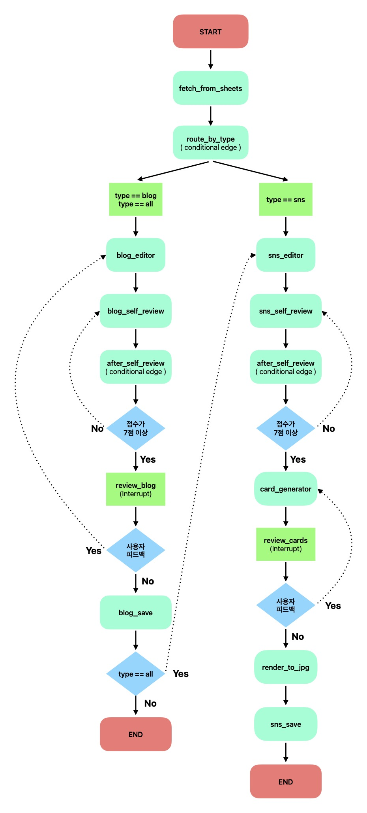

# content pilot (v1)

## 이름

- Content Pilot
- 사용자가 콘텐츠를 입력하면, 최종 목적지까지 안내한다는 뜻을 가지고 있습니다.

## 목적

- Google Sheets에 등록된 원고를 자동으로 교정·변환하여 블로그·SNS·슬라이드 등 각 채널에 맞는 콘텐츠로 제작하는 멀티채널 콘텐츠 파이프라인 에이전트를 제작하고자 했습니다.
- 현재 버전에서는 블로그와 SNS로만 동작합니다.

## 핵심 기능

- 시트 기반 콘텐츠 관리 : Google Sheets에 작성한 type, platform, tone 필드로 파이프라인 동작을 제어합니다. 새 콘텐츠 타입 추가 시 시트에 행만 추가하면 됩니다.
- 채널별 자동 분기 : type/platform 조합에 따라 Conditional Edge로 적절한 에디터와 출력 형식을 자동 선택합니다. blog, sns, all 3가지 타입을 지원합니다. 추후 slide 까지 추가할 예정입니다.
- 셀프 리뷰 루프 : 교정 결과를 별도 LLM이 자동 평가하고, 7점 미만이면 자동 재교정합니다 (최대 3회). 사람이 보기 전에 품질을 끌어올립니다.
- Human-in-the-Loop : interrupt/resume으로 교정 결과와 카드 뉴스 내용을 사람이 확인·수정 요청할 수 있습니다. 이후 Command로 승인/피드백 분기를 처리합니다.
- 멀티포맷 출력 : 블로그 포스팅, SNS 카드뉴스(JPG) 등 채널별 최적화된 형태로 출력합니다. 카드뉴스는 HTML 템플릿 + Playwright 렌더링 방식입니다.

## 활용한 LangGraph 기능

- State + Reducer : MessagesState 상속, 전체 파이프라인 상태 공유
- Conditional Edge : 콘텐츠 타입 분기, self_review 점수 분기
- Command : interrupt 후 승인/수정 동적 라우팅
- interrupt / resume : 교정 확인, 카드뉴스 확인 (Human-in-the-Loop)
- Checkpointer : 대화 메모리, 타임 트래블, 실행 이력
- ToolNode : 맞춤법 검사, 웹 검색 도구 실행

## 그래프 구조

## How to use?

- CLI
  - 실행 : python run.py
  - google sheets 연동이 되어 있는 경우, sheets에서 'pending' 상태인 row 하나를 읽고 프로세스를 진행합니다.
- streamlit cloud  
  - 좌측 메뉴에서 원하는 형태, 타겟을 선택합니다.
  - 하단 input 에 원하는 학습 기록을 적습니다.
  - 지시에 따라 추가 피드백을 제공하거나, 작업을 마무리합니다.
